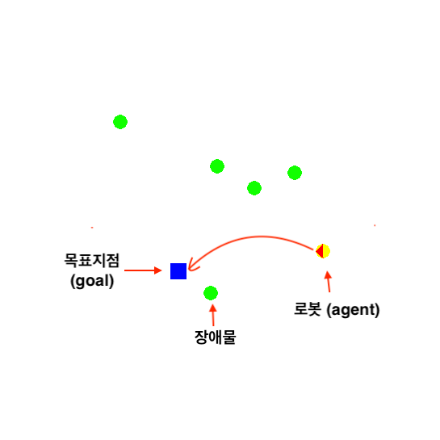

# Reinforcement Learning Project

## 프로젝트 정보

### 주제

장애물 환경에서의 모바일 로봇 자율주행 강화학습 기술 개발

### 팀원

- 이정필, 이범준

### 시뮬레이션 환경



## 환경

### git 받아오기

```
git clone https://github.com/lifefeel/RL-Project.git
```

### Python 가상환경 설치

```
cd RL-Project
virtualenv -p python3 myenv
source myenv/bin/activate
```

### Python 패키지 설치

```
pip install -r requirements.txt
```

### 

## 실행

### 학습

```bash
python train_DQN.py --mode train --env_seed 2
```

**arguments**

- mode: train / test
- env_seed: 장애물 환경(1:no, 2:static, 3: dynamic, 4:mixed)
- model_path: 모델이 저장될 경로
- model_name: 모델 이름
- overwrite: 모델 폴더를 덮어쓸지 여부(true/false)
- wandb: wandb 로깅 사용 시 설정(true/false)
- train_iters: 학습을 반복할 횟수(int)

### 테스트

**정적 장애물 환경**

```bash
python train_DQN.py --mode test --model_path trained_models --model_name dueling_double_dqn --checkpoint_file model_seed2.pt --env_seed 2
```

**동적 장애물 환경**

```bash
python train_DQN.py --mode test --model_path trained_models --model_name dueling_double_dqn --checkpoint_file model_seed3.pt --env_seed 3
```

